# Registro de actividades por día

## Día 1: Configuración inicial

- Creamos la carpeta del proyecto `Prueba-entrada-CC3S2/trivia-game-python` y la estructura base.

- Configuramos el entorno virtual con:
    - `python -m venv venv`
    - `source venv/Scripts/activate`

- Instalamos las dependencias principales, con `pip install fastapi uvicorn asyncpg databases python-dotenv`:
  - `fastapi`, `uvicorn`, `asyncpg`, `databases`, `python-dotenv`

- Generamos el archivo `requirements.txt` con las dependencias del entorno, usando el comando `pip freeze > requirements.txt`.

- Configuramos correctamente los archivos:
  - `.env` con las variables sensibles (`DATABASE_URL`, `SECRET_KEY`)
  - `Dockerfile` para construir la imagen de FastAPI
  - `docker-compose.yml` para levantar FastAPI y PostgreSQL

- Creamos la carpeta `app/` con el archivo `main.py` con un endpoint `/` que devuelve un mensaje de prueba.

- Inicializamos el repositorio Git:
  - Creamos la rama `develop` para desarrollo
  - Creamos la rama `feature/dia1` para trabajo diario

- Se documentó el contenido del `CHANGELOG.md` en la rama `feature/dia1`

- Se realizó el merge de `feature/dia1` → `develop` → `main`

- Se etiquetó el avance con el tag: `v1.0-day1`

## Día 2: Implementación de la clase Question y pruebas unitarias

- Creamos la clase `Question` en `app/trivia.py`, encargada de representar una pregunta de trivia.

  - Atributos: descripción de la pregunta, lista de las 4 posibles respuestas y el índice de la respuesta correcta.
  - Método `is_correct(self, answer_index)` para verificar si el índice ingresado por el jugador es el correcto.

- Creamos las pruebas unitarias en `tests/test_trivia.py` usando `pytest`.

  - Se añadió una tercera prueba para verificar que el índice de la respuesta no esté fuera de rango.

- Solucionamos un problema al ejecutar `pytest` agregando un archivo `__init__.py` en la carpeta `app/`. Para que así Python tome la carpeta `app` como paquete importable.

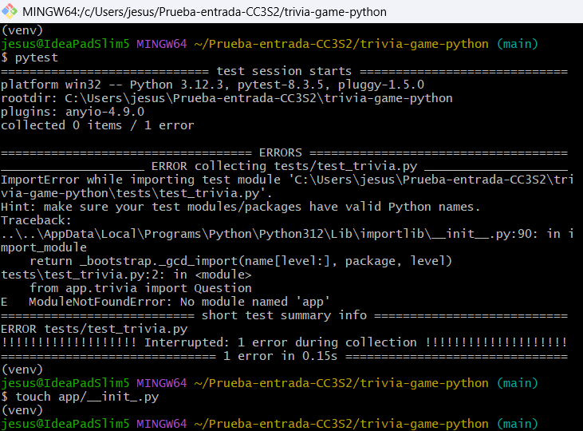

- Creamos el archivo `pytest.ini` para automatizar la configuración del entorno de pruebas.

  - Esto permite ejecutar `pytest` directamente sin necesidad de declarar el `PYTHONPATH` manualmente.

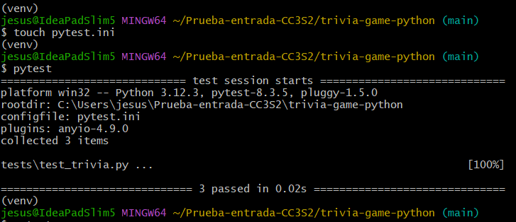

- Se ejecutaron correctamente los tests.

# Día 3: Implementación de la clase Quiz y flujo básico del juego

 - Creamos la clase `Quiz` en `trivia.py` para gestionar las preguntas del juego.

 - Se implementó la función `run_quiz()` para manejar el flujo del juego en la consola.

- Hasta ahora quedó así el juego de Trivia. 

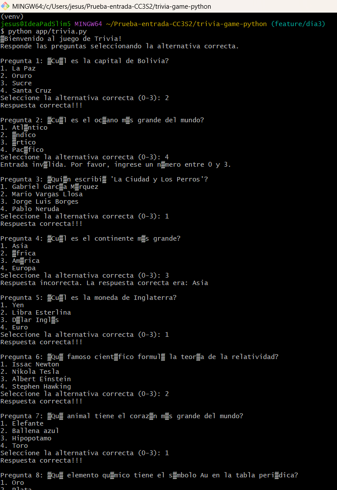

# Día 4: Sistema de puntuación, manejo de rondas y finalización del juego (Sprint 2)

- Modificamos la clase `Quiz` para:
  - Llevar el control de respuestas correctas.
  - Validar las respuestas del usuario con un nuevo método `answer_question`.

- Actualizamos la función `run_quiz()` para:
  - Mostrar un conteo de las respuestas correctas e incorrectas.

  - Añadir un bucle `while` para que repita la misma pregunta por si el usuario ingresa respuesta fuera de rango o inválida.

  - Añadir una opción de salida ingresando 'e' para finalizar el juego.

- Añadimos pruebas unitarias para verificar la puntuación del juego. 
  - Aqui presenté un error al hacer el testeo ya que en mi archivo trivia.py tenía `run_quiz()`  que hace que mi programa se ejecute automaticamente, para esto tuve que añadir `if __name__ == "__main__"` antes de `run_quiz()`.
    - Solo con `run_quiz()`:
  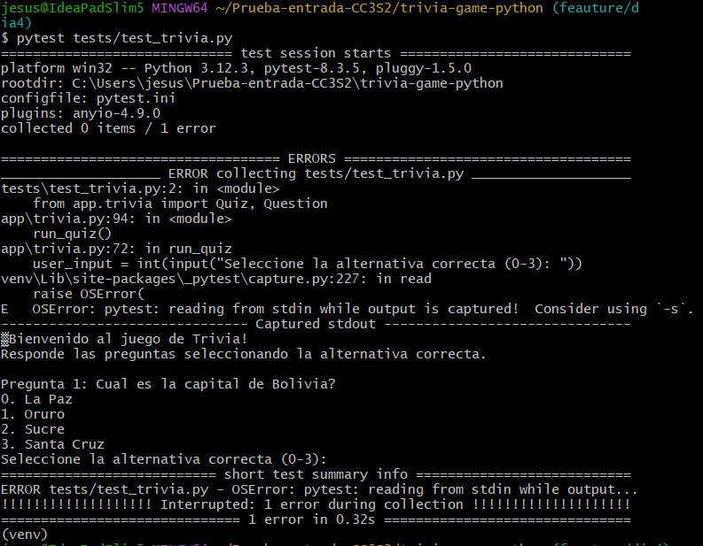

    - Con `if __name__ == "__main__"` antes de `run_quiz()`
  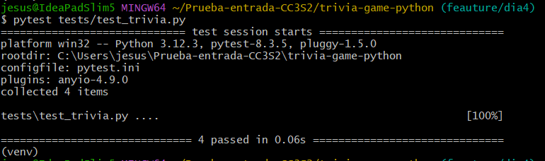

## Dia 5: Mejoras en la interfaz de usuario y refinamientos (Sprint 3)

  > NOTA: Previamente en el día 4 ya había implementado mensajes de bienvenida, resumen del final detallado y otras funciones para que el juego sea más dinámico, es por ese motivo que decidí realizar este día 5 el mismo día que se realizó el día 4 ya que no faltaba mucho que implementar.

- Modificamos la clase `Questios` y la función `run_quiz()` para que clasifique las preguntas por niveles del 1 al 3, siendo 1 el más fácil y el 3 lo más difícil.

- Por último realizamos pruebas de la interfaz para ajustar algún error en ella. 

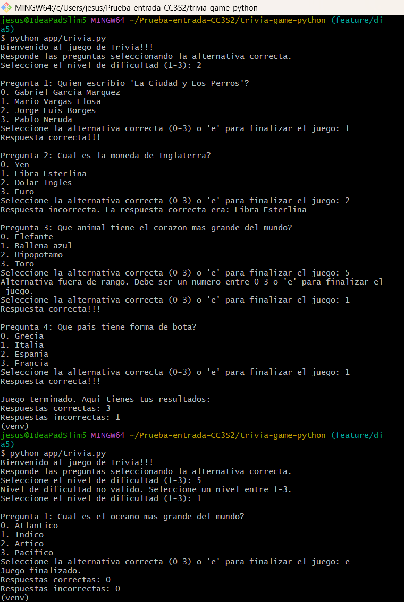

# Día 6: Pipeline CI/CD y pruebas de integración

- Creamos el archivo `.github/workflows/ci.yml` para automatizar la instalación de dependencias, ejecución de pruebas unitarias(pytest).
  > En este 1er paso de este día se complicó mucho ya que inicié usando SonarHub el cual me botaba errores ya que el entorno donde se estaba ejecutando el análisis tiene Java 11 y no Java 17, a pesar de que añadí un comando para instalar Java 17. Pero no se hace activo ya que esto corría dentro de un contenedor de Docker con su propia imagen basada en Java 11.

- Modifique mi archivo ci.yml para que funcione con SonarCloud, donde tambien  se requiere que mi proyecto esté registrado en SonarCloud. Una vez acá tambien busqué mi Project key y Organization key, y por último se desactivó el análisis automático de SonarCloud porque generaba conflictos con el análisis propio de GitHub Actions.

- Resolví también errores de compatibilidad con el escáner de SonarCloud, ignoramos los archivos `.c`, `.cpp` y `.mm` para tener una ejecución exitosa.

- Logramos la vinculación correcta del proyecto a la organización de SonarCloud y se validó la integración mediante GitHub Actions en cada push.

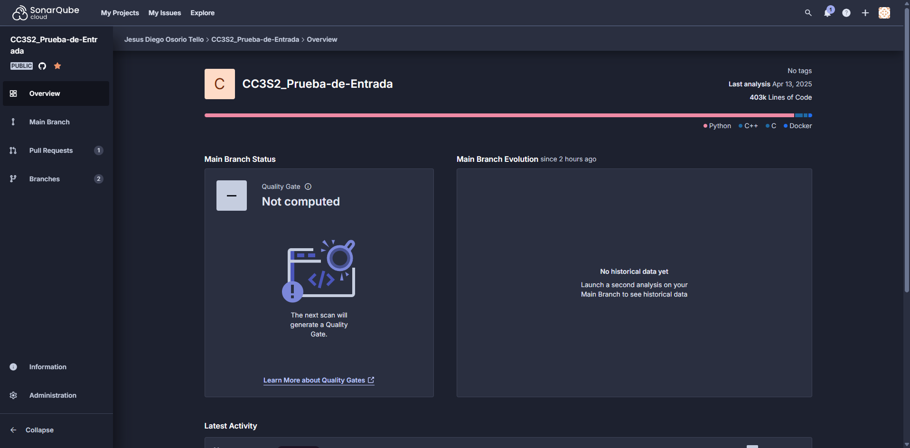

- Creamos una prueba de integración. Donde se verifica que la API `/questions/` responda con `201 created` cuando se crea una nueva pregunta correctamente.

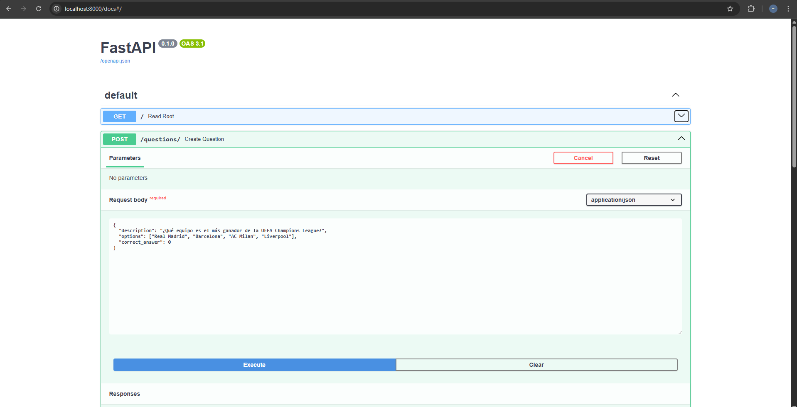
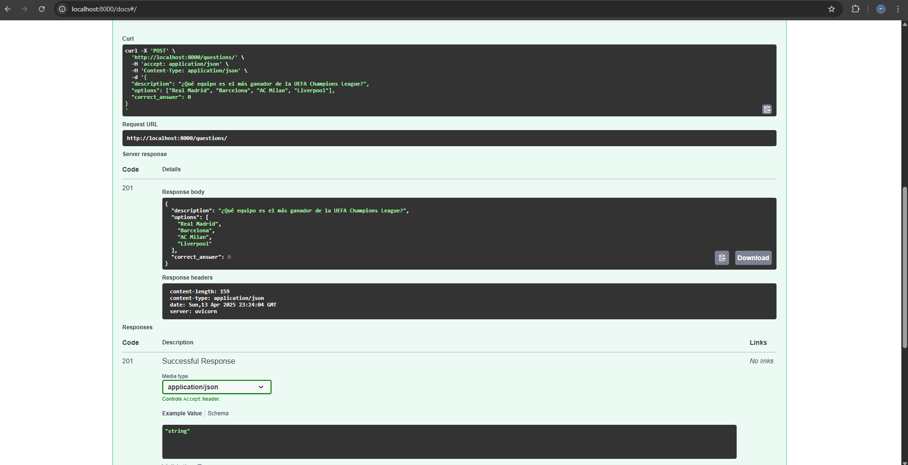

# Día 7: Gestión de configuración, seguridad y pruebas de rendimiento

- Implementamos pruebas de seguridad automatizadas utilizando Bandit para detectear vulnerabilidades

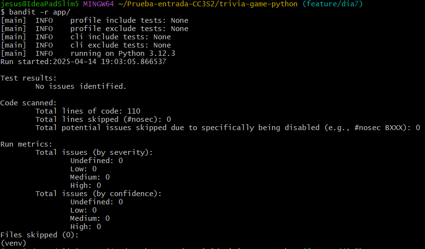

- Añadimos pruebas de carga con Locust para validar el rendimiento de la aplicación bajo carga

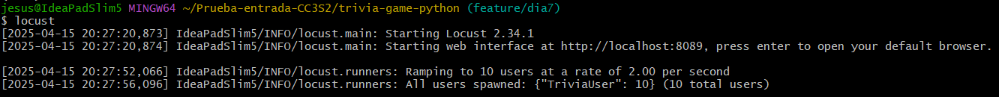
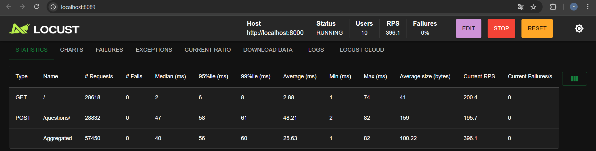
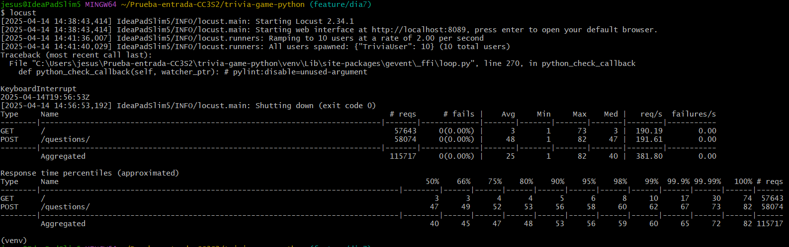

- Modificamos los archivos `main.py`, `trivia.py` para que se puedan ajustar a mejores testeos, por ende se añadieron nuevas pruebas de testeos a `test_trivia.py` y `test_apy.py`.

- Logramos validar que la cobertura de código supere el 90%, aunque no llegamos al 100%.

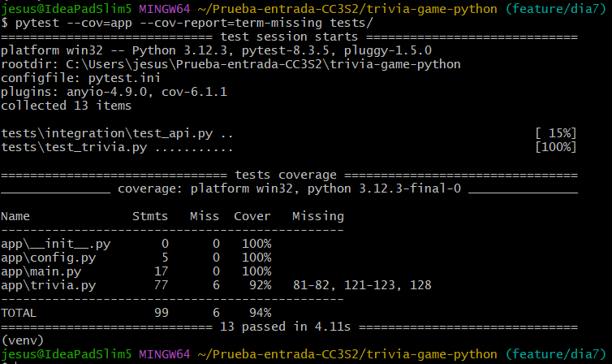

- Implementamos el uso del archivo .env para garantizar que las configuraciones sencibles estén gestionadas de forma segura.